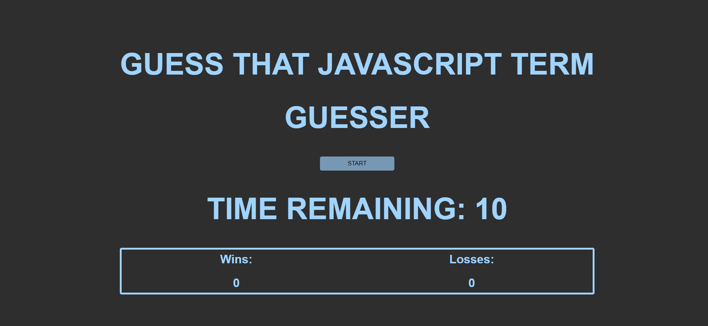
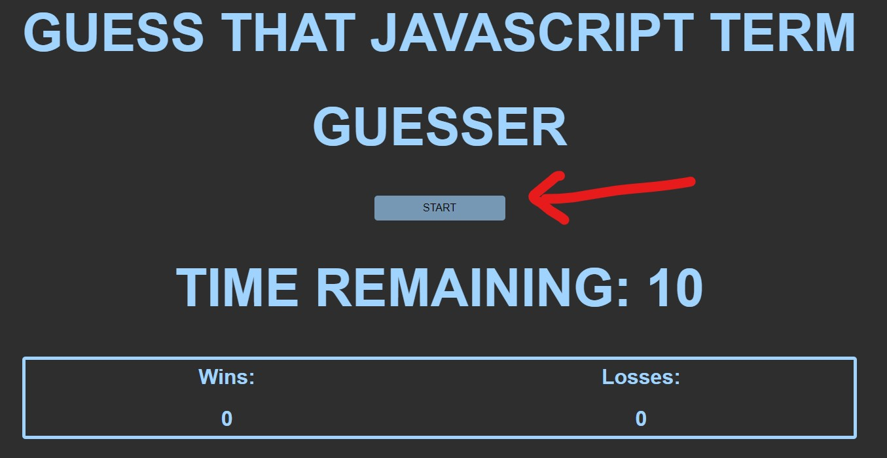
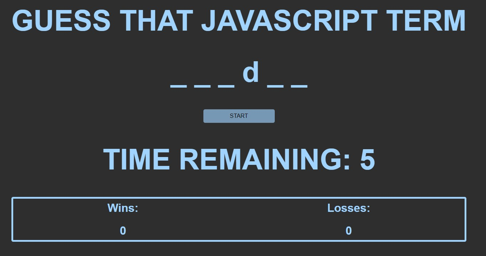

# Word Guesser Game

## Table of Contents
- [Project Goal](#Project-Goal)
- [Links](#Links)
- [Technologies](#Technologies)
- [Screenshot of Application](#Screenshot-of-Application)
- [User Instructions](#User-Instructions)
- [License](#License)
- [Contribution](#Contribution)
- [Acknowledgements](#Acknowledgements)

## Project Goal
To create an application, utilizing Javascript and Web APIs, that allows for the user to guess a word by pressing keys within a time limit.  This application's display is responsive to multiple screen sizes.  However, this application, is not fully accessible to mobile devices.

## Links
- ### [Click HERE for Deployed Application](https://inklein1997.github.io/Word-Guesser/)
- ### [Click HERE for Github Repository](https://github.com/inklein1997/Word-Guesser)

## Technologies

## Screenshot of Webpage

## User Instructions
1. Click **Start**.  
  
2. Using your keyboard, **press keys** to guess a letter.
  
3. If you completed the word and would like to play again, or if you would like a different word, click **Start**.

## License
This project is licensed under the terms of [MIT](https://opensource.org/licenses/MIT).
  
## Contribution
Before contributing to **Weather-Dashboard**, please read this [code of conduct](code_of_conduct.md)[^1]. 
Here's how you can contribute...
1. Add issue or recommendation for improvement to Issues tab on Github.
2. Submit pull request for review.

## Acknowledgements
- reset.css provided by the University of Texas at Austin Coding Bootcamp curriculum.